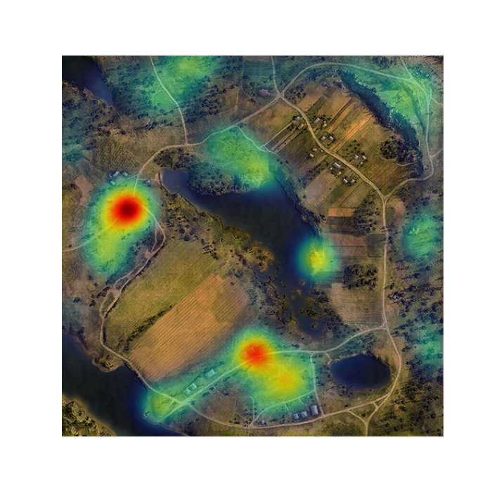

# WotHub
### About
[WotHub](https://wothub.herokuapp.com) is a data mining project for [World of Tanks](https://en.wikipedia.org/wiki/World_of_Tanks) in which we parse data packets from game replays, preprocess data and make players position predictions based on statistical approach. 
# How to use
> **Note: If you want to check out web version, jump to "[Deployment](https://github.com/pashok3d/WotHub#deployment)" section.**
### Preparing
* Download [replays](http://wotreplays.ru/) and place them in `/replays` folder. 
### Parsing 
For a parsing part we use [wotreplay-parser](https://github.com/evido/wotreplay-parser) created by [Jan Temmerman](https://github.com/evido).
* run `parser.py`

Parser reads replay files from `/replays` folder. Parsed data will appear in `/raw_data` folder in .json format for each replay.
### Preprocessing
* run `preprocessor.py`

It reads json files from `/raw_data` folder. Preprocessed data will appear in `/pro_data` folder in .csv format, accumulated for each map.

### Visualization
Visualization consists in creating position density plot where high values represent most frequent players positions. 
> **Note: Heroku does not store csv files, so we load data from AWS S3 Server, instead of `/pro_data` folder.**

We use streamlit for convenient manipulation. 

* `streamlit run .\web_visual.py` runs visualization on localhost

Example:

### Deployment
We use heroku for further project deployment. Here is a link to web app - [WotHub](https://wothub.herokuapp.com).

### To-do
- [ ] Replays scraper
- [ ] More data
